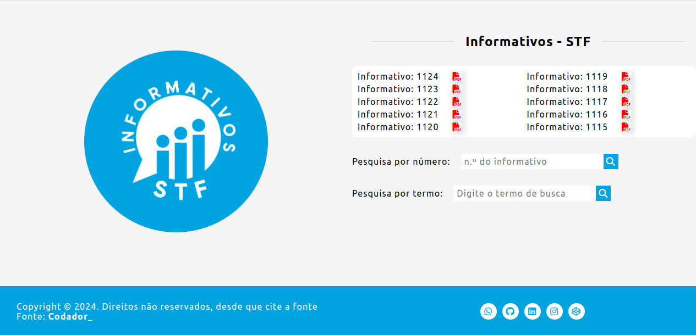
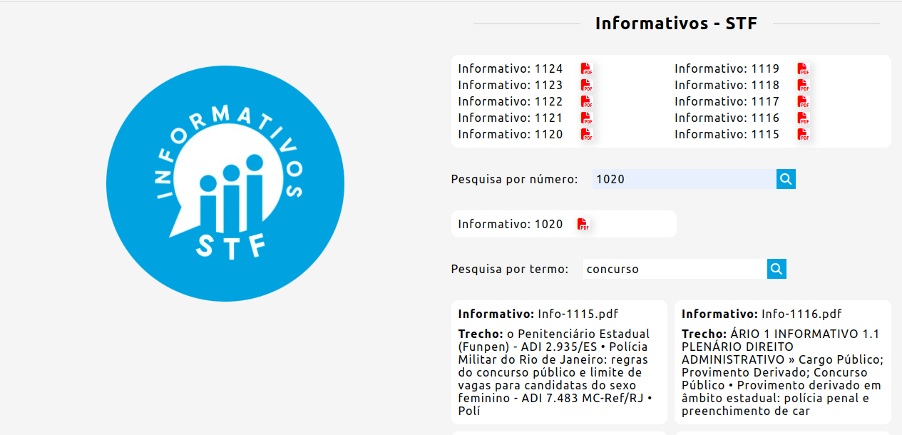

# Automatização de Informativos do STF

- Este projeto visa automatizar o processo de obtenção, conversão e pesquisa de informativos do Supremo Tribunal Federal (STF). Ele inclui scripts em Bash e PHP que facilitam o download, conversão para PDF e busca de informativos, proporcionando uma maneira eficiente de acessar e analisar os documentos disponibilizados pelo STF.

## Autor

- [@vitoriobsb](https://www.github.com/vitoriobsb)

## Estrutura de Diretórios

informativos-stf/

    ├── assets # Pasta contendo recursos como estilos CSS, scripts JavaScript e logotipos
        ├── css # Pasta de estilos CSS
            └── style.css # Arquivo de estilo CSS principal
        ├── favicons # Pasta de ícones de favoritos
            └── favicon-16x16.png # Ícone de favoritos em formato PNG
        ├── js # Pasta de scripts JavaScript
            └── script.js # Arquivo de script JavaScript principal
        └── logo # Pasta de logotipos
            └── logo.png # Arquivo de logotipo em formato PNG
    ├── index.php # Arquivo principal PHP da aplicação
    ├── informativos # Pasta que pode conter os arquivos PDF de informativos (vazia no momento)
    ├── script.sh # Script Bash para automatizar tarefas relacionadas aos informativos
    └── search.php # Arquivo PHP para realizar pesquisas nos informativos

## 🔗 Links

## 🛠 Habilidades

- HTML
- CSS
- Javascript
- PHP
- MySQL
- Angular
- Shell
- Script
- Python
- React
- Git
- GitHub

## Logo

## Recursos

- **Download de Informativos**: Baixa automaticamente os informativos do STF diretamente do site oficial.
- **Conversão para PDF**: Converte os informativos baixados para o formato PDF para facilitar a visualização e análise.
- **Pesquisa Avançada**: Permite buscar termos-chave dentro dos informativos, facilitando a localização de informações específicas.
- **Organização de Arquivos**: Estrutura de pastas bem definida para armazenamento dos informativos baixados e convertidos.

## Principais Recursos

- **Navegação Intuitiva:** Uma interface de usuário bem projetada permite que os usuários naveguem pelos informativos de forma simples e eficiente.
- **Pesquisa Avançada:** Utilize nossa poderosa ferramenta de pesquisa para encontrar rapidamente informações específicas dentro dos informativos.
- **Visualização Amigável:** Os informativos são apresentados em formato PDF para uma visualização clara e legível.
- **Organização Eficiente:** Todos os arquivos são organizados de forma lógica e acessível, facilitando a localização e o gerenciamento dos documentos.

Descubra uma nova maneira de acessar e explorar os informativos do STF com o nosso front-end intuitivo!

## Como Usar

- **Clone o Repositório**: Faça uma cópia do repositório em sua máquina local.
- **Permissões Necessárias**: Antes de executar o script `script.sh` (Bash), verifique se possui as permissões necessárias para executá-lo e se a pasta `informativos` tem as permissões corretas.
- **Execute os Scripts**: Execute os scripts `script.sh` (Bash) e `search.php` (PHP) para baixar, converter e pesquisar os informativos, respectivamente.
- **Personalize**: Personalize os scripts conforme necessário, ajustando os parâmetros de configuração conforme sua preferência.

## Requisitos

- Shell Bash
- PHP
- Ferramentas de linha de comando como `curl`, `wkhtmltopdf` e `unzip` instaladas e configuradas corretamente.

## Contribuindo

- Contribuições são sempre bem-vindas!
- Veja `contribuindo.md` para saber como começar.
- Por favor, siga o `código de conduta` desse projeto.

## Licença

- Este projeto está licenciado sob a [MIT](https://choosealicense.com/licenses/mit/) License.

## Interface do Usuário (Front-end)

